**English** | [한국어](./README.md)

#  Mobile Wedding Invitation (w/ AI Chatbot)

[](LICENSE)
[](https://www.python.org/downloads/)
[](https://fastapi.tiangolo.com/)
[](https://www.langchain.com/)

https://github.com/user-attachments/assets/05eb2772-9dc3-4b66-af2c-09c4497946cf

> 🤖 Modern mobile wedding invitation web application with AI chatbot

A self-made mobile wedding invitation application. 🤗
Provides various features including AI chatbot, guestbook, RSVP, and admin dashboard to communicate with guests and efficiently manage wedding preparations.

## ✨ Key Features

### 🎞️  Opening Animation

| Animation                                  |
|--------------------------------------------|
| 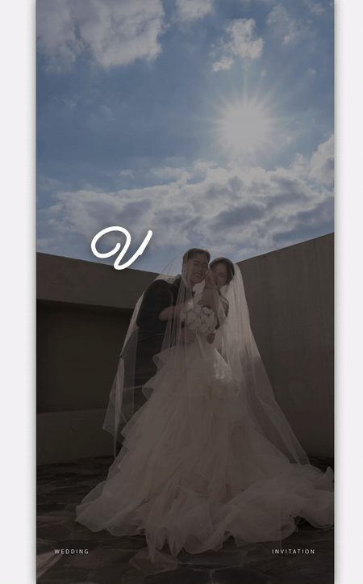 |

An animation that plays when accessing the page. Displays designated photos and text.


### 🤖 AI Chatbot (LangGraph-based)

| Example1                                            | Example2                                            |
|-----------------------------------------------------|-----------------------------------------------------|
| 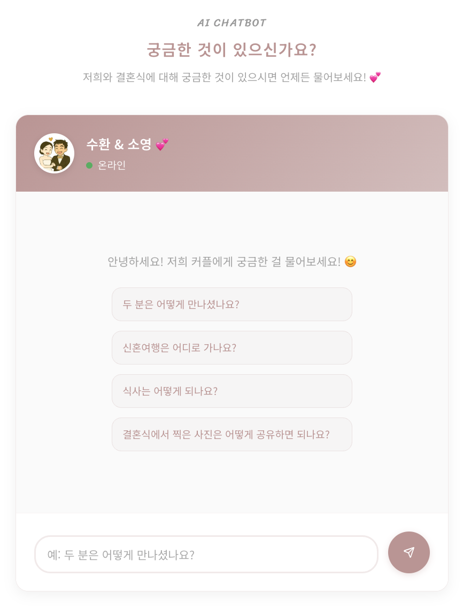 | 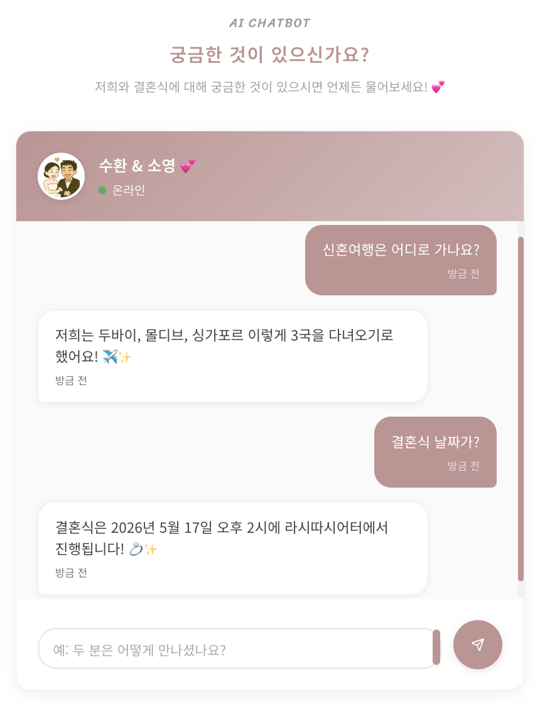 |

RAG-based chatbot that naturally answers questions about the bride and groom.

### 📝 Guestbook & RSVP

| Guestbook                                    | Write Page                                         | RSVP                                    | RSVP                                    |
|----------------------------------------------|----------------------------------------------------|------------------------------------------|------------------------------------------|
| 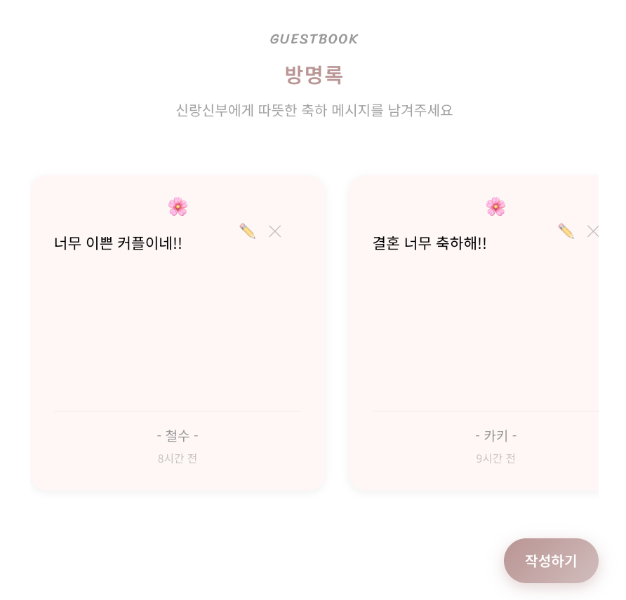 | 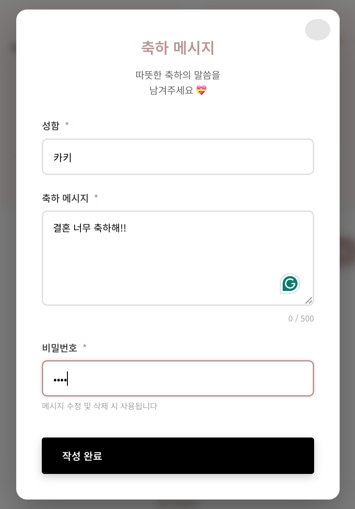 | 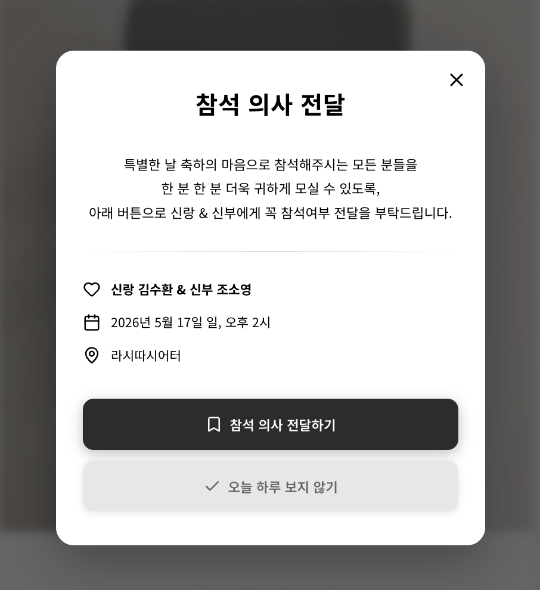 | 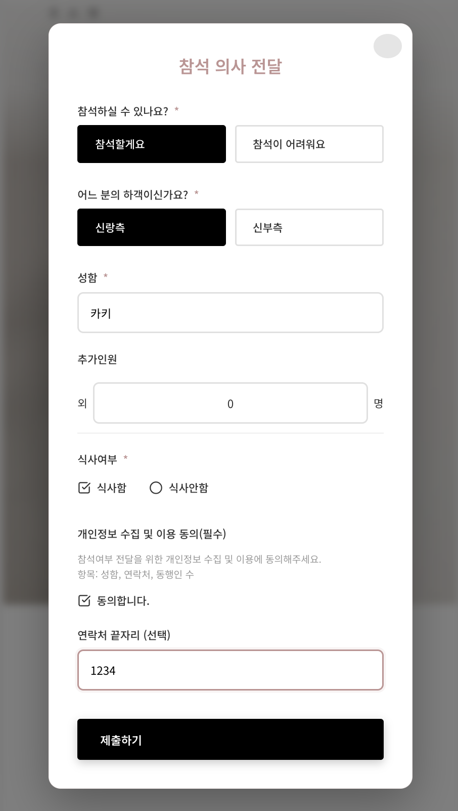 |

Real-time creation/editing/deletion of congratulatory messages, attendance confirmation and statistics. Password protection, bride/groom side distinction.

### 📸  Photo Gallery & Upload

| Photo Upload Page                        | Upload Success Page                                   |
|------------------------------------------|-------------------------------------------------|
| 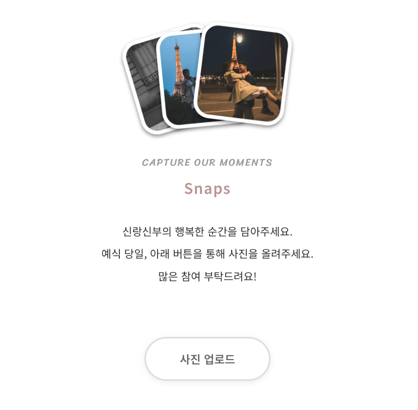 | 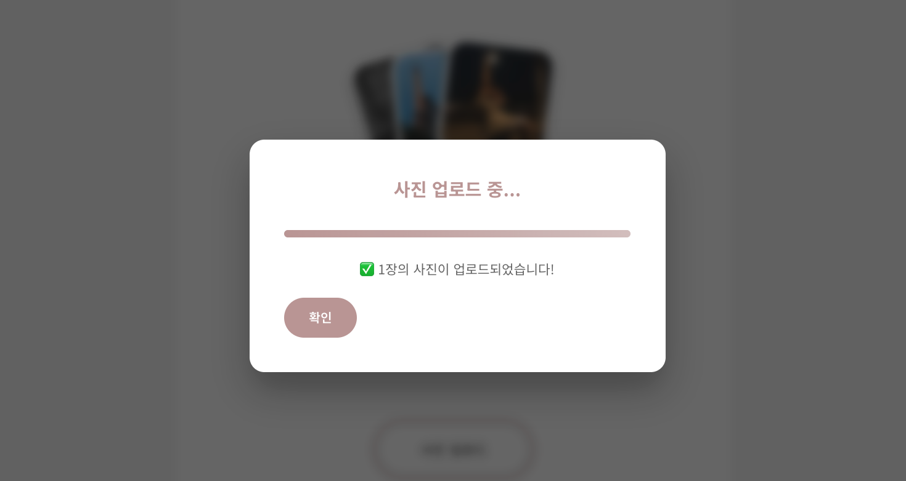 |

Photo upload functionality using AWS S3. Allows guests to easily share wedding photos.

### 👨‍💼 Admin Page

| Admin Login                              | Admin Page                                |
|------------------------------------------|-------------------------------------------|
| 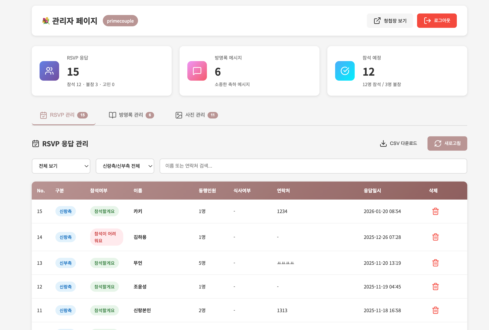 | 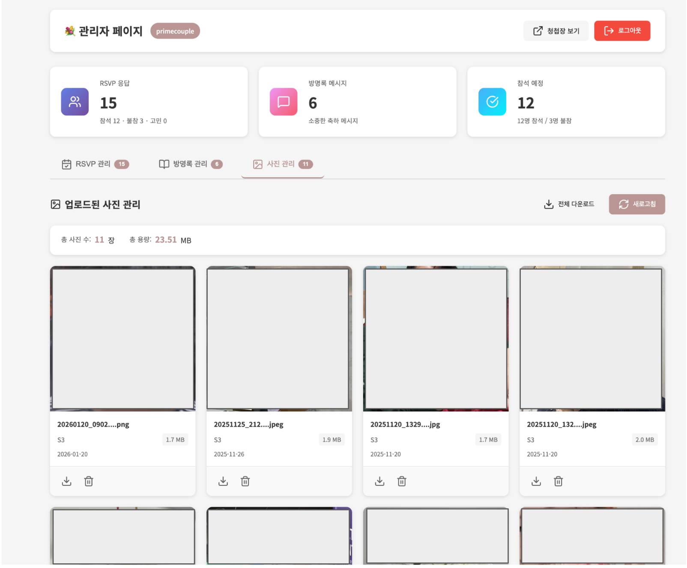 |

Session-based authentication, integrated RSVP and guestbook management, CSV export, real-time statistics.

### 🎨 Etc. Features
🗺️ Map & Transportation | 💰 KakaoPay Transfer | 📅 Google Calendar Integration
🎵 Background Music | 📱 KakaoTalk Sharing | 📊 Visitor Statistics

---

## 🚀 Quick Start

### Pre-requisites
- Python 3.10+
- OpenAI API key (for AI chatbot)
- AWS account and S3 bucket (for photo upload feature)
- (Production) PostgreSQL or Railway account

### Setup

**1️⃣ Clone and install**
```bash
git clone https://github.com/sooftware/wedding-invitation.git
cd wedding-invitation
pip install -r requirements.txt
```

**2️⃣ Configure environment variables**
```bash
cp .env.example .env
# Set OpenAI API key and admin password
```

**3️⃣ Run**
```bash
python main.py
# Access http://localhost:8000
```

### Deployment

> 📖 **Detailed guides**: [Installation Guide](docs/INSTALLATION.md) | [Railway Deployment Guide](docs/DEPLOYMENT.md)

---

## 📚 Documentation

| Category | Documents |
|---------|------|
| **Getting Started** | [Installation Guide](docs/INSTALLATION.md) · [Railway Deployment](docs/DEPLOYMENT.md) |
| **Configuration** | [config.json Setup](docs/CONFIGURATION.md) · [AI Chatbot Setup](docs/CHATBOT.md) · [Design Customization](docs/CUSTOMIZATION.md) |
| **Help** | [FAQ](docs/FAQ.md) |

---

## 🛠️ Tech Stack

- **Backend**: FastAPI · LangChain · LangGraph · Chroma · PostgreSQL/SQLite

- **Frontend**: Vanilla JS · Lucide Icons · CSS3

- **AI/ML**: OpenAI GPT-4o-mini · OpenAI Embeddings · LangSmith

- **Storage**: AWS S3 (boto3)

- **DevOps**: Railway · Docker · GitHub Actions

---

## 📦 Project Structure

```
wedding-invitation/
├── app/                    # Backend (FastAPI, LangGraph chatbot, DB)
├── config/                 # Configuration (wedding info, chatbot knowledge base)
├── static/                 # Static files (CSS, JS, images)
├── templates/              # HTML templates
├── scripts/                # Utilities (password generation, image optimization)
├── docs/                   # Documentation
└── main.py                 # App entry point
```

> 📖 See [Architecture Documentation](docs/ARCHITECTURE.md) for detailed structure

---

## 📄 License

This project follows the **CC BY-NC-SA** license.

-  ✅ Can be used for personal weddings
-  ✅ Can be modified and redistributed (with same license and attribution)
-  ❌ Commercial use prohibited
-  ❌ Wedding invitation service prohibited

See [LICENSE](./LICENSE) file for details.

---

## 🙏 References

- [our-wedding-invitation](https://github.com/anthopark/our-wedding-invitation)
- [FastAPI](https://fastapi.tiangolo.com/)
- [LangChain](https://www.langchain.com/)
- [LangGraph](https://langchain-ai.github.io/langgraph/) 
- [Railway](https://railway.app/)

---

**Made with ❤️ by [Soohwan Kim](https://github.com/sooftware) & [Soyoung Cho](https://github.com/SoYoungCho) & [Claude Code](https://claude.ai/code)**
